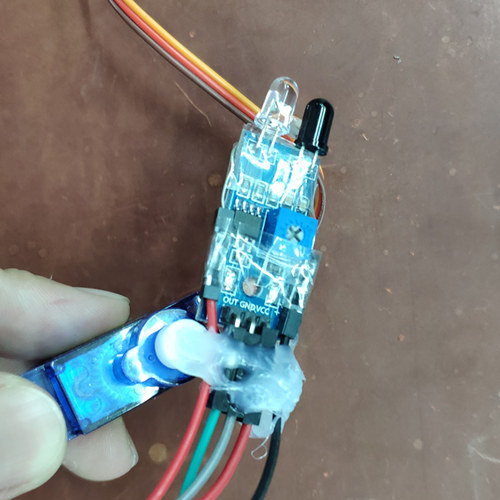
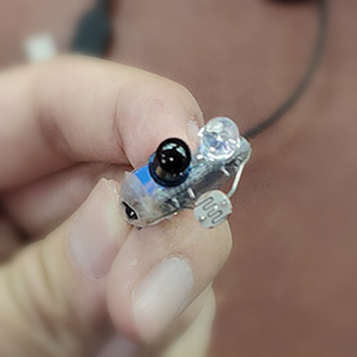
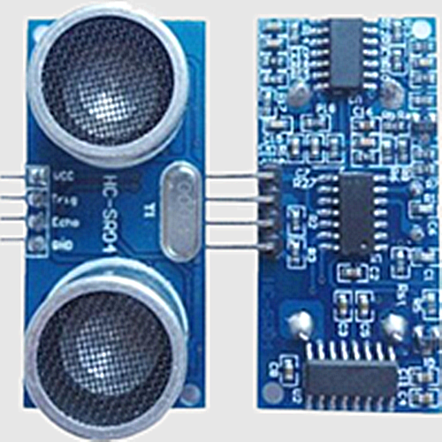
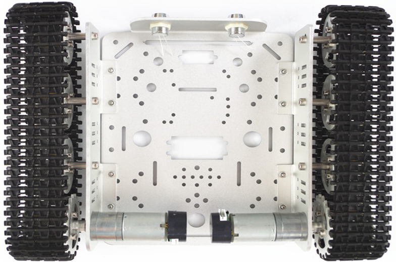
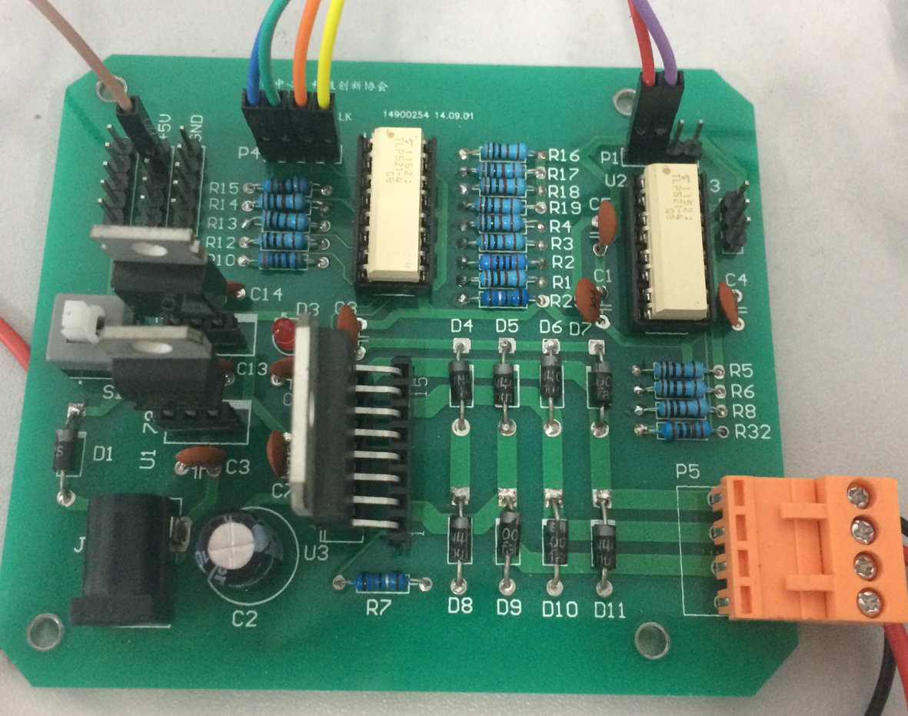

# Buggie-Bot
Course Project. A smart car based on arduino who chase the light and avoid obstacles like a bug :)

    

## Perception System
- Light Dependent Resistor
- IR Proximity Sensor
- Ultrasonic Distance Sensor
- Servo (for scanning)

        

## Action System
- 2 DC Motors
- Motor Driver Board

       

